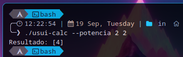
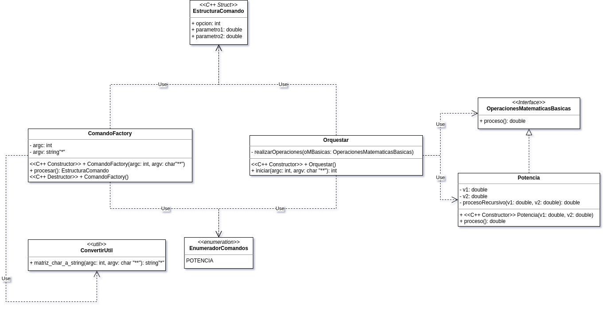

# USUI-CALC

## Descripción
Este proyecto tiene como objetivo implementar operaciones aritméticas y utilización de funciones recursivas para realizar estas operaciones.

### Aclaración
Por el momento el método **procesorRecursivo**, no entendera lo que debe hacer con un exponente decimal.

#### Ejemplo:
Si introduces una base (2,23) y un exponente del mismo valor (2,23), esta retornara el valor (11,08) en vez de retornar (5,98).<br>
#### En conclusión:
El método realizara la siguiente operacion, en base (2,23) con un exponente (3).

## Comandos [Opciones]
por el momento este proyecto presenta una sola opción.

### Ejemplo:
```sh
./usui-calc --potencia 2 2
```
dará como resultado lo siguientes:
```sh
Resultado: [4]
```

## Preview


## Diagrama de Clases [UML]


## Version
**c++17**

## Construido con 🛠️
- Lenguaje **C++**

## Autor ✒️
- **Usui, José Fernando** - _Diseño y Desarrollo del Sistema_

## Contacto 📱
- Gmail: _joesesilvae@gmail.com_
